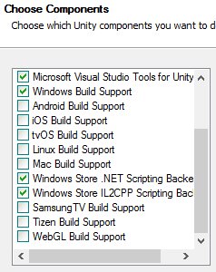
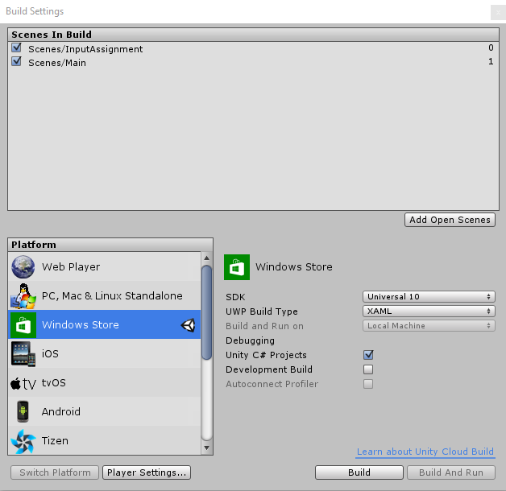
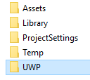
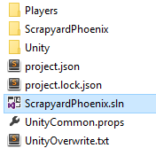

---

title: Bringing Unity games to UWP on Xbox
description: Unity UWP development on Xbox.

ms.date: 02/08/2017
ms.topic: article

keywords: windows 10, uwp
ms.assetid: fca3267a-0c0f-4872-8017-90384fb34215
ms.localizationpriority: medium
---

# Bringing Unity games to UWP on Xbox

In this step-by-step tutorial, we assume that you already have a game in Unity, ready to be built and deployed.

See also a [video version of this tutorial](https://www.youtube.com/watch?v=f0Ptvw7k-CE).

Looking to version your Unity UWP project? See [Version control your UWP project](development-lanes-unity-versioning.md).

## Step 0: Ensure Unity is installed correctly

When installing Unity, these components must be selected:

## Step 1: Building the UWP solution

In your Unity game project, open the **Build Settings** windows located at **File -> Build Settings**, and go to the Microsoft Store options menu.

Make sure the **SDK** setting is set to **Universal 10**, and then select the **Build** button, which will launch a File Explorer window asking for a destination folder. Create a folder named **UWP** next to the **Assets** directory of your project, and choose this folder as the destination folder of the build.

Unity has now created a new Visual Studio solution that we will use to deploy your UWP game from.

## Step 2: Deploying your game

Open the newly generated solution in the **UWP** folder, and then change the target platform to **x64**.

Now that you have a UWP Visual Studio solution for your game, [following these steps](getting-started.md) will allow you to successfuly deploy your game onto your retail Xbox One!

## Step 3: Modify and rebuild

If changes are made to anything that isn't a script, for these changes to be shown in your game's UWP build, the project must be rebuilt from within the Editor (as described in __Step 1__).

## Versioning your UWP project

There are a few common situations where adding parts of this newly generated UWP directory to version control becomes necessary. For example, if you're adding a new dependency to the UWP project (for example, the Xbox Live SDK).  We go over this example in detail at [Version control your UWP project](development-lanes-unity-versioning.md).

## See also
- [Bringing existing games to Xbox](development-lanes-landing.md)
- [UWP on Xbox One](index.md)
